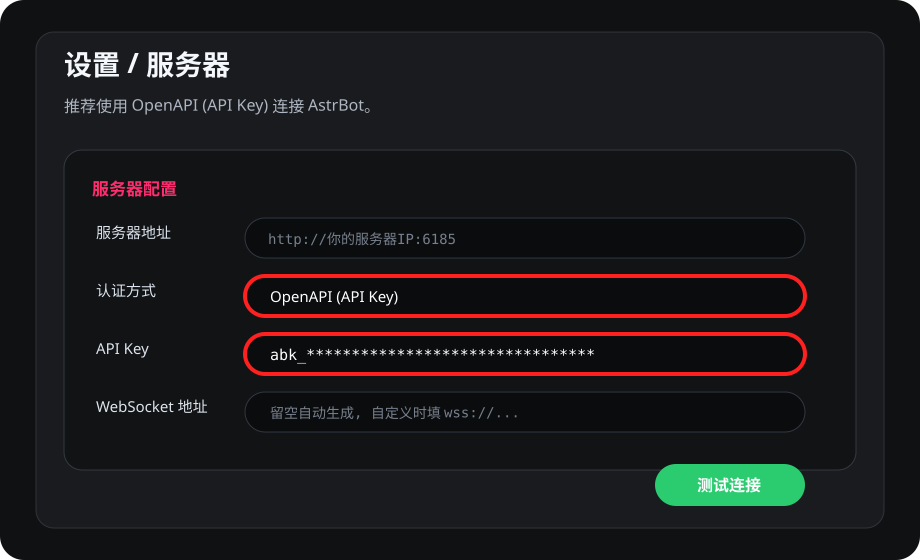
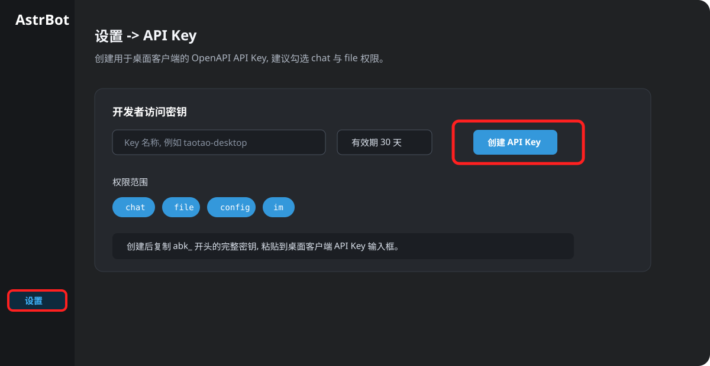

# 🎈 AstrBot 桌面助手 —— 你的桌面 AI 陪伴

<div align="center">

[](https://github.com/muyouzhi6/Astrbot-desktop-assistant/actions/workflows/ci.yml)
[](https://www.python.org/)
[](https://wiki.qt.io/Qt_for_Python)
[](LICENSE)

**一个安静陪伴你的桌面悬浮球，随时可聊、随时可见**

[⚡ 快速安装](#-快速安装) · [🆕 本次更新](#-本次更新重点) · [✨ 核心功能](#-核心功能) · [🔌 附加能力](#-附加能力qq-远程功能) · [🍎 平台说明](#-平台特别说明)

</div>

---

## 🆕 本次更新重点

### 🐾 默认桌宠形象：桃桃

桌面入口现在默认使用 **桃桃**，这是木有知自己制作的 Q 版桌宠形象。第一次启动时不再只是一个悬浮球，而是一个会待在桌面上的小桌宠；如果你更喜欢传统悬浮球，也可以在「设置 → 外观 → 桌面形象」里切回「悬浮球」。

同时支持导入 **CodexPet 兼容宠物包**来自定义桌宠形象。宠物包需要包含 `pet.json` 和 `spritesheet.webp`，在「设置 → 外观 → 宠物形象 → 添加宠物形象」中选择宠物包目录、`pet.json` 或 `spritesheet.webp` 即可导入。


### 🔐 OpenAPI (API Key) 连接

新增 **OpenAPI (API Key)** 连接模式，推荐新用户优先使用。相比早期的账号密码模式，API Key 更适合长期连接和远程部署：不需要在客户端保存 AstrBot 管理员密码，服务端升级后也更稳定。

在桌面客户端中打开「设置 → 服务器」，将「认证方式」切换为 `OpenAPI (API Key)`，填入 `abk_` 开头的 API Key 后保存。WebSocket 地址可以留空，客户端会自动按服务器地址生成；如果你使用了反向代理或自定义路径，再填写完整 `ws://` / `wss://` 地址。



API Key 在 AstrBot 管理面板中创建：进入「设置」，找到「API Key」区域，填写 Key 名称，选择有效期，然后点击「创建 API Key」。建议至少勾选 `chat` 和 `file` 权限：`chat` 用于对话和 WebSocket 远控认证，`file` 用于图片、截图等附件上传；如果你的 AstrBot 面板按图中方式提供 `config`、`im` 等权限，也可以一起勾选，省得后续功能扩展时再回来补权限。



### 🔌 服务端插件同步适配

OpenAPI 模式下，桌面客户端会通过 AstrBot OpenAPI 上传图片、截图等附件，并用 API Key 连接远控 WebSocket。请同步更新服务端插件 [astrbot_plugin_desktop_assistant](https://github.com/muyouzhi6/astrbot_plugin_desktop_assistant) 到 `v1.1.5` 或更新版本，否则可能出现聊天可用但截图、远程桌面状态、QQ 远控等能力不可用的问题。

---

## 🌈 为什么选择桌面助手？

想象一下，有一个 AI 伙伴：

- 🎈 **随时可见** —— 一个小巧的悬浮球，安静地待在你的桌面角落
- 💬 **随时可聊** —— 点一下就能对话，不需要打开任何网页或 App
- 👀 **能看懂你的屏幕** —— 遇到报错？让它帮你分析，不用复制粘贴
- 🤗 **主动关心你** —— 发现你长时间工作，会温柔提醒你休息

这不只是一个工具，而是一个**陪伴**。

---

## 🎈 悬浮球：你的桌面 AI 伙伴

<div align="center">

```
     ╭──────────────────────────────────╮
     │                                  │
     │    🟢  ← 悬浮球：你的 AI 伙伴     │
     │                                  │
     │    点击即可对话                   │
     │    它能看懂你的屏幕               │
     │    它会主动关心你                 │
     │                                  │
     ╰──────────────────────────────────╯
```

</div>

### 悬浮球的独特之处

| 特点 | 传统 AI 聊天 | 桌面悬浮球 |
|------|-------------|-----------|
| **存在感** | 需要打开网页/App | 始终在桌面陪伴你 |
| **交互方式** | 主动去找它 | 它就在那里，点一下即可 |
| **屏幕理解** | 需要复制粘贴 | 直接"看懂"你的屏幕 |
| **主动性** | 只会被动回答 | 会主动关心你的状态 |
| **情感连接** | 冷冰冰的工具 | 温暖的陪伴感 |

---

## ✨ 核心功能

### 💬 随时对话

点击悬浮球，打开对话窗口，和你的 AI 伙伴聊天。

```
你：今天有点累...
AI：我注意到你已经连续工作了 3 个小时了呢，要不要站起来活动一下？
    我可以帮你设置一个 10 分钟后的提醒 ☕
```

**沉浸式对话体验**：
- 📝 完整 Markdown 渲染（代码高亮、公式、表格）
- 🖼️ 图片/文件拖拽发送
- 🔊 语音消息自动播放
- ⌨️ 快捷键发送（Enter/Shift+Enter）

### 👀 屏幕感知

AI 能"看到"你屏幕上的内容，帮你分析问题。

```
（你遇到一个代码报错）
你：帮我看看这个报错
AI：我看到了，这是一个 NullPointerException。
    问题出在第 42 行，userService 没有被正确初始化。
    你可以在调用前加上空值检查，或者检查依赖注入配置...
```

### 🤗 主动交互

AI 会根据屏幕内容，在合适的时机主动给你建议。

```
（你在浏览技术文章）
AI：这篇关于 Rust 异步编程的文章不错！
    需要我帮你总结一下关键点吗？

（你长时间盯着代码发呆）
AI：看起来遇到了难题？要不要说说你的思路，
    我帮你梳理一下？
```

### 🚀 持续进化

悬浮球是一个可扩展的能力平台，支持插件扩展：

- 🔌 插件系统支持自定义扩展
- 🎨 主题自适应（亮色/暗色自动切换）
- ⚡ 全局热键快速唤起
- 🖥️ 系统托盘后台常驻

---

## ⚡ 快速安装

### 前置条件

- ✅ AstrBot 服务端已部署并运行
- ✅ 已安装服务端插件 [astrbot_plugin_desktop_assistant](https://github.com/muyouzhi6/astrbot_plugin_desktop_assistant) `v1.1.5` 或更新版本

### 🌟 方式一：一键安装（推荐）

> 🚀 自动检测最快的下载源、安装依赖、配置开机自启、创建桌面快捷方式

**Windows 用户**：

打开 **PowerShell**（Win + X，选择 Windows Terminal），运行：

```powershell
irm "https://gh.llkk.cc/https://raw.githubusercontent.com/muyouzhi6/Astrbot-desktop-assistant/main/quick_install.bat" -OutFile "$env:TEMP\quick_install.bat"; Start-Process "$env:TEMP\quick_install.bat"
```

💡 也可以 [下载 quick_install.bat](https://gh.llkk.cc/https://raw.githubusercontent.com/muyouzhi6/Astrbot-desktop-assistant/main/quick_install.bat)，双击运行。

**macOS / Linux 用户**：

打开终端，运行：

```bash
curl -fsSL https://gh.llkk.cc/https://raw.githubusercontent.com/muyouzhi6/Astrbot-desktop-assistant/main/quick_install.sh | bash
```

💡 也可以 [下载 quick_install.sh](https://gh.llkk.cc/https://raw.githubusercontent.com/muyouzhi6/Astrbot-desktop-assistant/main/quick_install.sh)，然后运行 `chmod +x quick_install.sh && ./quick_install.sh`。

### 方式二：克隆后安装

```bash
# 克隆项目
git clone https://github.com/muyouzhi6/Astrbot-desktop-assistant.git
cd Astrbot-desktop-assistant

# Windows：双击 install.bat
# macOS/Linux：chmod +x install.sh && ./install.sh
```

### 方式三：手动安装

```bash
git clone https://github.com/muyouzhi6/Astrbot-desktop-assistant.git
cd Astrbot-desktop-assistant

# 创建虚拟环境（推荐）
python3 -m venv venv
source venv/bin/activate  # Linux/macOS
# 或 venv\Scripts\activate  # Windows

# 安装依赖
pip install -r requirements.txt

# 启动
python -m desktop_client
```

### 连接服务端

首次启动后：

1. 右键悬浮球 → 选择「设置」
2. 填写服务器地址：
   - 本地部署：`http://127.0.0.1:6185`
   - 远程服务器：`http://你的服务器IP:6185`
3. 认证方式推荐选择 `OpenAPI (API Key)`
4. 在 AstrBot 管理面板「设置 → API Key」中创建 API Key，并复制 `abk_` 开头的完整密钥
5. 回到桌面客户端，粘贴到「API Key」输入框，保存设置

如果你还在使用旧版本插件，也可以继续选择账号密码模式；但新版本更推荐 OpenAPI (API Key)，尤其是远程服务器、Docker 部署、截图附件上传和 QQ 远控场景。

点击悬浮球，说一声"你好"，你的桌面 AI 伙伴已经准备好了 🎉

### 兼容性说明

- 本仓库是桌面客户端，AstrBot 平台适配器和 `DesktopAssistantAdapter` 相关代码在服务端插件仓库 [astrbot_plugin_desktop_assistant](https://github.com/muyouzhi6/astrbot_plugin_desktop_assistant)
- 如果升级 AstrBot 后出现 `DesktopAssistantAdapter.__init__() takes 3 positional arguments but 4 were given` 这类报错，需要更新服务端插件版本，单独重装桌面客户端通常解决不了

---

## 🔌 附加能力：QQ 远程功能

> 🎁 **锦上添花**：如果你已经在用 AstrBot + NapCat，还可以解锁 QQ 远程能力

除了桌面陪伴，你还可以通过 QQ 远程控制和查看电脑：

### 远程截图

在 QQ 上发送命令，获取电脑实时画面：

| 命令 | 功能 |
|------|------|
| `.截图` 或 `.screenshot` | 截取桌面屏幕并返回图片 |
| `.桌面状态` | 查看桌面客户端连接状态 |

### 使用场景

- 出门在外，想看看电脑上的下载进度
- 在 QQ 群里让 bot 帮你分析屏幕上的报错
- 远程查看家里电脑的状态

```
你（在 QQ 上）：.截图
Bot：[返回你电脑的实时截图]

你：帮我看看这个报错是什么问题
Bot：根据截图，你的代码第 42 行有个 NullPointerException...
```

### 远程功能配置

需要正确配置 WebSocket 连接：

1. 确保服务端插件已启用
2. 客户端启用远控 WebSocket。OpenAPI 模式会使用同一个 API Key 认证；账号密码模式会使用旧 token 认证
3. 在客户端设置中配置 WebSocket 端口（默认 6190），或在反向代理场景填写完整 WebSocket 地址
4. 开放服务器防火墙端口 6190

```bash
# Linux (firewalld)
sudo firewall-cmd --add-port=6190/tcp --permanent
sudo firewall-cmd --reload

# Linux (ufw)
sudo ufw allow 6190/tcp
```

详细配置请参阅 [服务端插件文档](https://github.com/muyouzhi6/astrbot_plugin_desktop_assistant#-附加能力qq-远程功能)。

---

## 🍎 平台特别说明

### macOS

**系统要求**：macOS 10.14+ / Python 3.10+

**悬浮球置顶**：自动安装 `pyobjc-framework-Cocoa` 实现窗口置顶。

**常见问题**：

| 问题 | 解决方案 |
|------|----------|
| 启动脚本双击无反应 | `chmod +x start.command` |
| 依赖安装失败 | `xcode-select --install` |

### Linux

**系统依赖**：

```bash
# Ubuntu/Debian
sudo apt install libgl1-mesa-glx libxcb-xinerama0 libxcb-cursor0 libegl1

# Fedora
sudo dnf install mesa-libGL libxcb
```

**Wayland 支持**：启动脚本自动设置 `QT_QPA_PLATFORM=wayland;xcb`。

### Windows

开箱即用，无特殊依赖。

---

## ⚙️ 开机自启配置

### 自动配置（推荐）

使用一键安装脚本时会提示配置开机自启。

### 手动配置

1. 右键悬浮球或系统托盘 → 选择「设置」
2. 在「通用设置」中勾选「开机自启动」
3. 保存设置

### 故障排查

| 平台 | 检查方法 |
|------|----------|
| Windows | 注册表 `HKEY_CURRENT_USER\Software\Microsoft\Windows\CurrentVersion\Run` |
| macOS | `launchctl list \| grep astrbot` |
| Linux | `~/.config/autostart/astrbot-desktop-assistant.desktop` |

---

## 🧹 卸载

### Windows

1. 退出桌面客户端
2. 删除项目目录或一键安装生成的程序目录
3. 如启用了开机自启，在客户端设置里先关闭，或删除注册表 `HKEY_CURRENT_USER\Software\Microsoft\Windows\CurrentVersion\Run` 中的 `AstrBotDesktopAssistant`
4. 按需删除配置和聊天记录目录 `%APPDATA%\AstrBotDesktopClient`

### macOS / Linux

1. 退出桌面客户端
2. 删除项目目录或虚拟环境目录
3. 如启用了开机自启，删除对应自启动项
   - macOS `~/Library/LaunchAgents/astrbot.desktop.assistant.plist`
   - Linux `~/.config/autostart/astrbot-desktop-assistant.desktop`
4. 按需删除配置和聊天记录目录 `~/.config/astrbot-desktop-client`

### 服务端插件卸载

如果不再需要 QQ 远程截图、桌面状态等能力，还需要到服务端单独卸载 [astrbot_plugin_desktop_assistant](https://github.com/muyouzhi6/astrbot_plugin_desktop_assistant)，它不包含在桌面客户端目录里。

---

## 📦 目录结构

```
desktop_client/
├── gui/          # 界面组件（悬浮球、聊天窗口、设置）
├── handlers/     # 消息处理器（消息、截图、主动对话）
├── platforms/    # 平台适配器（Windows/macOS/Linux）
├── services/     # 核心服务（API通信、截图、桌面监控）
├── plugins/      # 插件系统
├── config.py     # 配置管理
├── bridge.py     # 消息桥接层
└── main.py       # 程序入口
```

详细架构说明请参阅 [docs/ARCHITECTURE.md](docs/ARCHITECTURE.md)。

---

## 🤝 参与贡献

我们欢迎任何形式的贡献！

```bash
# Fork 并克隆项目
git clone https://github.com/YOUR_USERNAME/Astrbot-desktop-assistant.git
cd Astrbot-desktop-assistant

# 创建虚拟环境
python -m venv venv
source venv/bin/activate  # Linux/macOS

# 安装依赖并运行测试
pip install -r requirements.txt
pytest
```

| 资源 | 说明 |
|------|------|
| [CONTRIBUTING.md](CONTRIBUTING.md) | 贡献指南 |
| [docs/ARCHITECTURE.md](docs/ARCHITECTURE.md) | 架构文档 |
| [Issue 模板](.github/ISSUE_TEMPLATE/) | 报告 Bug / 功能请求 |

---

## 🔗 相关链接

| 资源 | 链接 |
|------|------|
| 🔌 服务端插件 | [astrbot_plugin_desktop_assistant](https://github.com/muyouzhi6/astrbot_plugin_desktop_assistant) |
| 🔊 TTS 语音插件 | [astrbot_plugin_tts_emotion_router](https://github.com/muyouzhi6/astrbot_plugin_tts_emotion_router) |
| 🤖 AstrBot 主项目 | [AstrBot](https://github.com/Soulter/AstrBot) |

---

## 📄 许可证

MIT License

---

<div align="center">

**不只是工具，而是陪伴**

*桌面悬浮球 —— 让 AI 真正成为你的伙伴*

[报告问题](https://github.com/muyouzhi6/Astrbot-desktop-assistant/issues) · [参与讨论](https://github.com/muyouzhi6/Astrbot-desktop-assistant/discussions) · [参与贡献](CONTRIBUTING.md)


本插件开发QQ群：215532038


</div>
